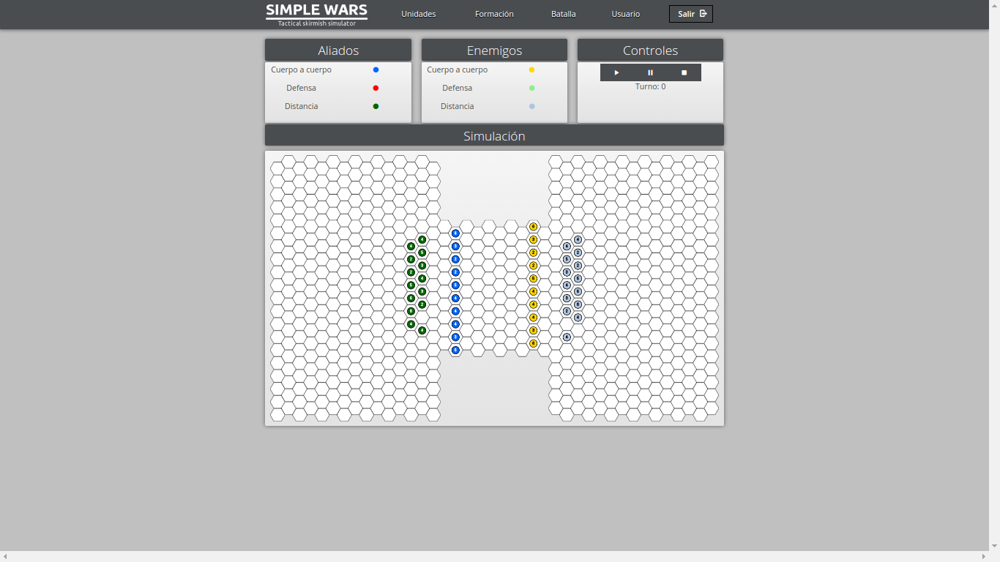

# Simple wars

This strategy game was conceived and developed autonomously as a final degree project. A key objective of the project was to ensure that all technologies employed were previously unfamiliar to the developer. Particular emphasis was placed on the utilization of WebGL for rendering the game's graphics and animations.

### Local demo setup
#### Prerequisites
* [Docker](https://docs.docker.com/engine/install/)
* [Docker Compose](https://docs.docker.com/compose/install/)
* [(Optional) Post intallation steps](https://docs.docker.com/engine/install/linux-postinstall/)

#### Install
* ``make install``
* ``make load``

#### Start
* ``make start``

#### Stop
* ``make stop``

#### Maps editor
* ``make editor``

#### Help
* ``make help``
```
* help                 Display help message
* debug                Debug Makefile itself
* install              Install game
* load                 Restore game data
* start                Run game
* editor               Run maps editor app
* stop                 Stop game
```

### Screenshots




### Benchmarks


### Simulation


### Map generation


* [Docs](http://dehesa.unex.es/handle/10662/3534)
